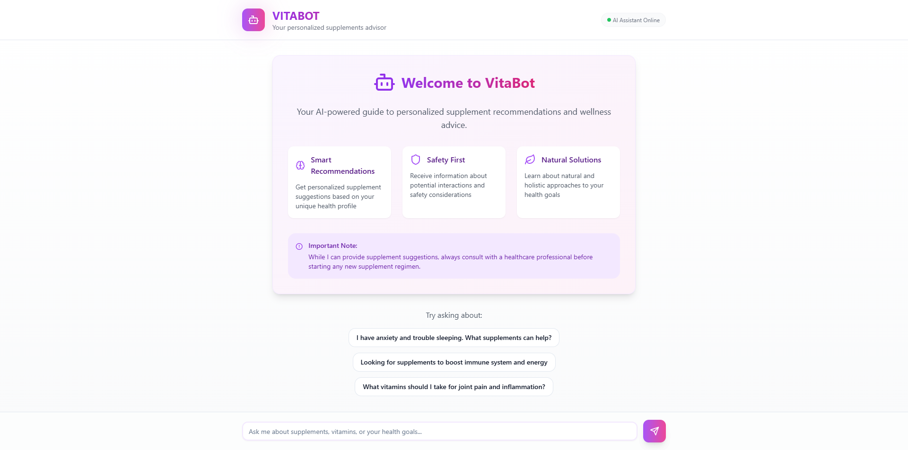

# Vitabot

Vitabot is a personalized supplement recommendation system powered by AI, developed by [Humaima](https://github.com/humaimaa) and [Asma](https://github.com/asmaumar2004) as part of their Computational Intelligence Course project in BSCS.

## Project Overview

Vitabot is an intelligent chatbot that provides personalized supplement recommendations using OpenAI's GPT models and Next.js. It features a modern, responsive interface with real-time chat capabilities and voice input support.

## Key Features

- **AI-Powered Chat Interface**: Interactive conversations using GPT-4
- **Voice Input**: Speech-to-text capability for hands-free interaction
- **Real-time Responses**: Streaming API responses for immediate feedback
- **Responsive Design**: Modern UI that works across all devices
- **Markdown Support**: Rich text formatting in chat messages
- **Suggested Queries**: Pre-defined questions for easy starting points

## Tech Stack

- **Frontend**: Next.js 14, React, TypeScript
- **UI Framework**: Tailwind CSS, Lucide Icons
- **AI/ML**: OpenAI GPT-4, LangChain
- **APIs**: Web Speech API, OpenAI Streaming API

## Project Structure

```
vitabot/
├── src/
│   ├── app/
│   │   ├── api/
│   │   │   ├── chat/
│   │   │   └── ex4/
│   │   ├── components/
│   │   └── data/
├── public/
└── package.json
```

## Setup Instructions

1. **Clone the repository:**
   ```bash
   git clone https://github.com/humaimaa/vitabot.git
   cd vitabot
   ```

2. **Install dependencies:**
   ```bash
   npm install
   ```

3. **Environment Setup:**
   Create a `.env.local` file with:
   ```
   OPENAI_API_KEY=your_api_key_here
   ```

4. **Start Development Server:**
   ```bash
   npm run dev
   ```

5. **Access the Application:**
   Open [http://localhost:3000](http://localhost:3000)

## Key Components

- **Chat Interface**: `src/app/components/chat.tsx`
- **API Routes**: 
  - `src/app/api/chat/route.ts`: Main chat endpoint
  - `src/app/api/ex4/route.ts`: Enhanced chat with context

## Features in Detail

### AI Chat Interface
- Real-time message streaming
- Markdown formatting support
- Chat history management
- Loading states and animations

### Voice Input
- Speech-to-text conversion
- Recording status indicator
- Timer display during recording

### UI/UX
- Responsive layout
- Dark/light mode support
- Animated transitions
- Loading indicators
- Message typing indicators

## Contributing

1. Fork the repository
2. Create your feature branch (`git checkout -b feature/AmazingFeature`)
3. Commit your changes (`git commit -m 'Add some AmazingFeature'`)
4. Push to the branch (`git push origin feature/AmazingFeature`)
5. Open a Pull Request

## Contributors

- [Humaima](https://github.com/humaimaa)
- [Asma](https://github.com/asmaumar2004)

## Interface

<div style="display: flex; align-items: flex-start;">
    
</div>

