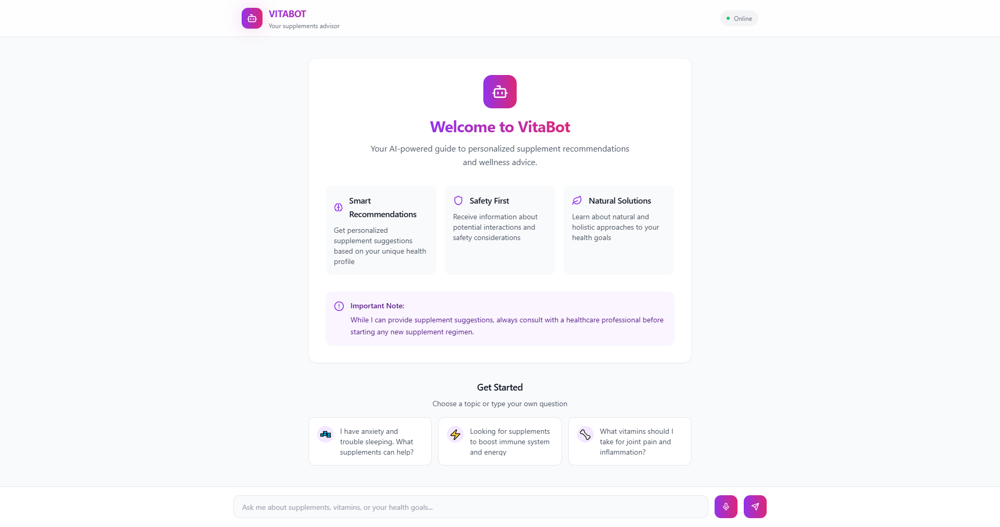

# Vitabot

Vitabot is a project developed by [Humaima](https://github.com/humaimaa) and [Asma](https://github.com/asmaumar2004) as part of their Semester Project for the Computational Intelligence Course in BSCS.

## Project Overview

Vitabot is designed to assist users with personalized supplement recommendations using AI-powered techniques. It leverages computational intelligence to provide accurate and tailored health advice.

## Features

- **Personalized Supplement Recommendations**: Tailored supplement suggestions based on user health goals and conditions.
- **Interactive Chat Interface**: Engage with an AI-powered chat interface to ask health-related questions.
- **AI-Powered Responses**: Utilizes OpenAI's GPT-4 model to deliver accurate and detailed answers.

## Project Structure

The project follows a clean and modular architecture:

```
.env.local
.eslintrc.json
.gitignore
.next/
package.json
public/
README.md
src/
  app/
    components/
    data/
    lib/
tailwind.config.ts
tsconfig.json
```

### Key Files and Directories

- **`.env.local`**: Environment variables (e.g., OpenAI API key).
- **`.eslintrc.json`**: ESLint configuration.
- **`.gitignore`**: Specifies files to be ignored by Git.
- **`package.json`**: Dependency and script definitions.
- **`public/`**: Static assets.
- **`src/app/`**: Main application logic.
  - **`components/`**: Reusable UI components.
  - **`data/`**: Application data.
  - **`lib/`**: Utility libraries.
- **`tailwind.config.ts`**: Tailwind CSS configuration.
- **`tsconfig.json`**: TypeScript configuration.

### Important Files

- **`next.config.mjs`**: Next.js configuration.
- **`src/app/layout.tsx`**: Defines the root layout and metadata.
- **`src/app/components/chat.tsx`**: Chat interface logic.
- **`src/app/api/chat/route.ts`**: Handles chat API endpoints.
- **`src/app/api/ex4/route.ts`**: Additional API endpoint for predefined requests.

## Setup Instructions

To set up the project locally, follow these steps:

1. **Clone the repository:**
    ```bash
    git clone https://github.com/humaimaa/vitabot.git
    ```

2. **Navigate to the project directory:**
    ```bash
    cd vitabot
    ```

3. **Install the required dependencies:**
    ```bash
    npm install
    ```

4. **Set up environment variables:**
    Create a `.env.local` file in the root directory and add the following:
    ```env
    OPENAI_API_KEY=your_openai_api_key_here
    ```

5. **Run the project:**
    ```bash
    npm start
    ```

Access the app at `http://localhost:3000`.

## Deployment

The project can be deployed on Vercel. Ensure the `OPENAI_API_KEY` environment variable is configured in your deployment settings.

## API Endpoints

- **POST /api/ex4**: Defined in `src/app/api/ex4/route.ts`
- **POST /api/chat**: Defined in `src/app/api/chat/route.ts`

## Additional Information

### Tailwind CSS Configuration
Tailwind CSS is used for styling, with configurations located in `tailwind.config.ts`.

### ESLint Configuration
Linting is enforced via ESLint, configured in `.eslintrc.json`.

## Screenshots

### Screenshot 1


## Contributors

- [Humaima](https://github.com/humaimaa)
- [Asma](https://github.com/asmaumar2004)

## License

This project is licensed under the MIT License.
